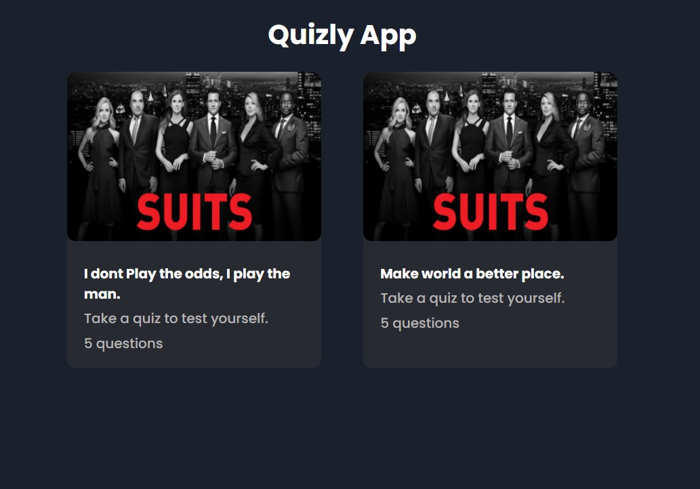
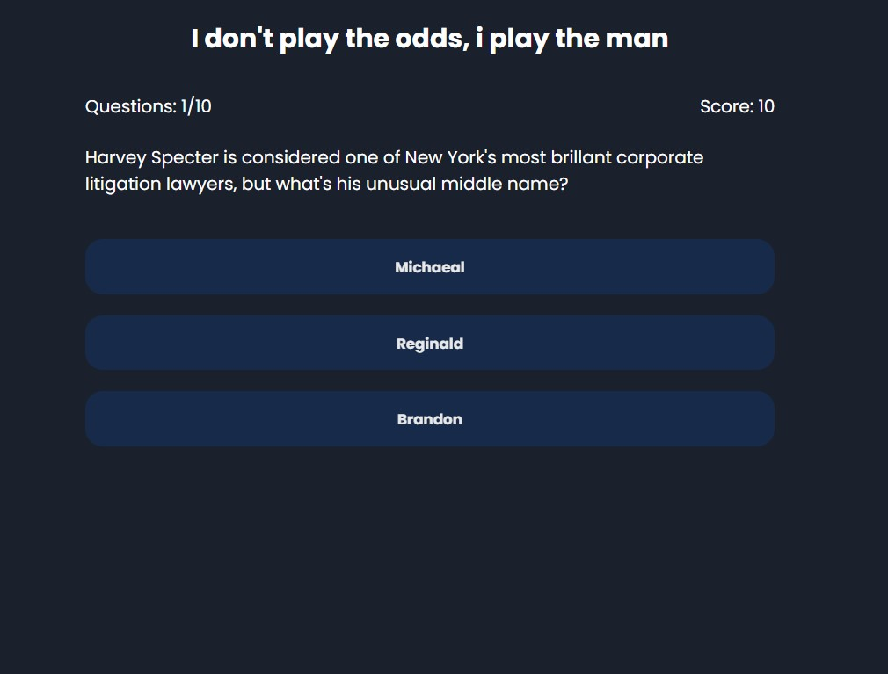
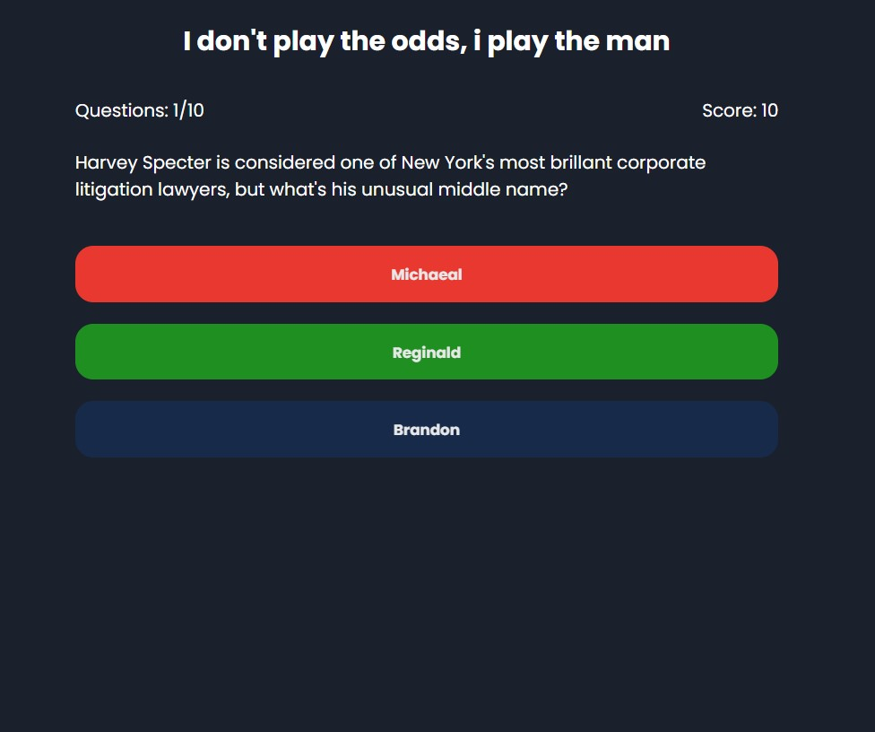
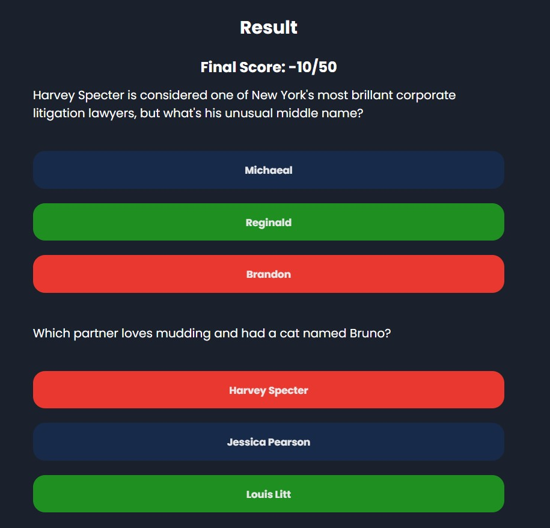
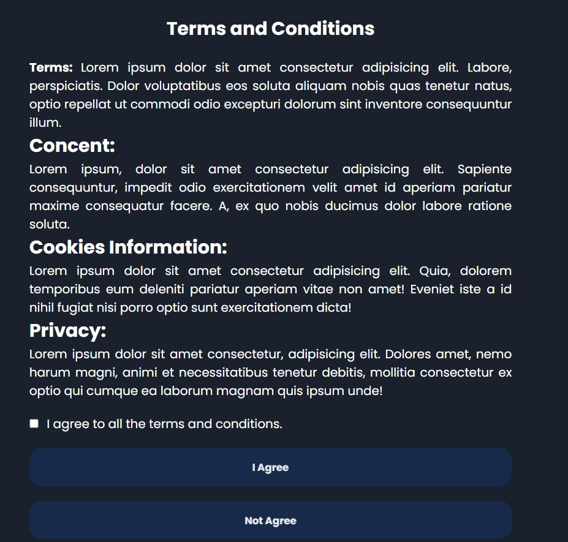

# Quizzly Quiz App

Quizzly is modern web app which allows users to test there mind. Apart from that there are many features which makes this website more powerful.

----
## Tech Stack

**Used:** HTML, CSS, Componently Frontend Library

----

## Pages

 - [HomePage](https://quizly-quiz.netlify.app/)
 - [Question](https://quizly-quiz.netlify.app/pages/ques.html)
 - [Question with validation](https://quizly-quiz.netlify.app/pages/ques1.html)
 - [Question with correct answer](https://quizly-quiz.netlify.app/pages/ques2.html)
 - [Result](https://quizly-quiz.netlify.app/pages/result.html)
 - [Terms & condition Page](https://quizly-quiz.netlify.app/pages/tnc.html)

----

## Screenshots
Home Page

Question

Question with Validation

Result Page

Terms & Conditions Page

----

## Authors

- [@spraveenofficial](https://www.github.com/spraveenofficial)